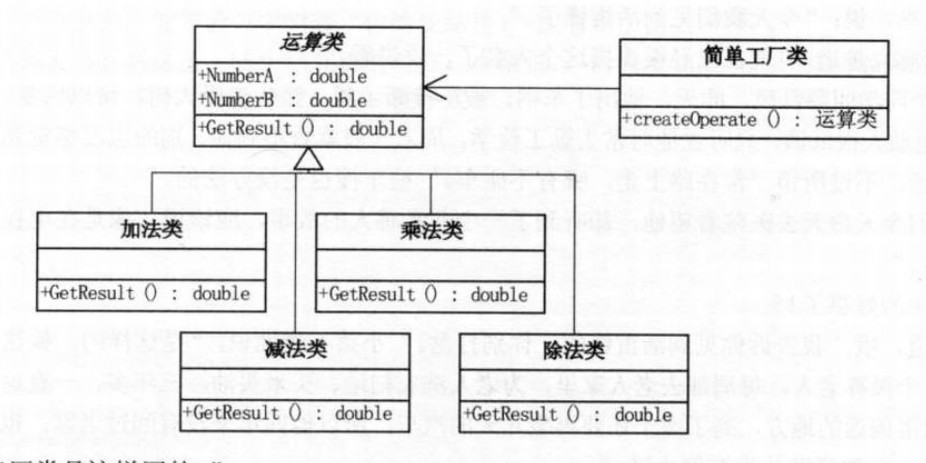

# 工厂模式

## 什么是工厂模式？
### 工厂模式是用来创建对象的一种最常用的设计模式。我们不暴露创建对象的具体逻辑，而是将逻辑封装在一个函数中，那么这个函数就可以被视为一个工厂。工厂模式根据抽象程度的不同可以分为简单工厂，工厂方法，抽象工厂。

## 简单工厂模式
## 1.目的
### 在创建一个对象时不向客户暴露内部细节，并提供一个创建对象的通用接口。

## 2.类图

### 简单工厂把实例化的操作单独放到一个类中，这个类就成为简单工厂类，让简单工厂类来决定应该用哪个具体子类来实例化。
### 这样做能把客户类和具体子类的实现解耦，客户类不再需要知道有哪些子类以及应当实例化哪个子类。客户类往往有多个，如果不使用简单工厂，那么所有的客户类都要知道所有子类的细节。而且一旦子类发生改变，例如增加子类，那么所有的客户类都要进行修改。

### 简单工厂违反了设计模式的OCP（开闭原则，Open-Closed Principle）：一个软件的实体应当对扩展开 放，对修改关闭。

## 计算器设计类图

## 3.优点
### 最大优点在于工厂类中包含了必要的逻辑判断，根据客户端的选择条件动态创建实例化相关的类，对于客户端来说，去除了与具体产品的依赖
