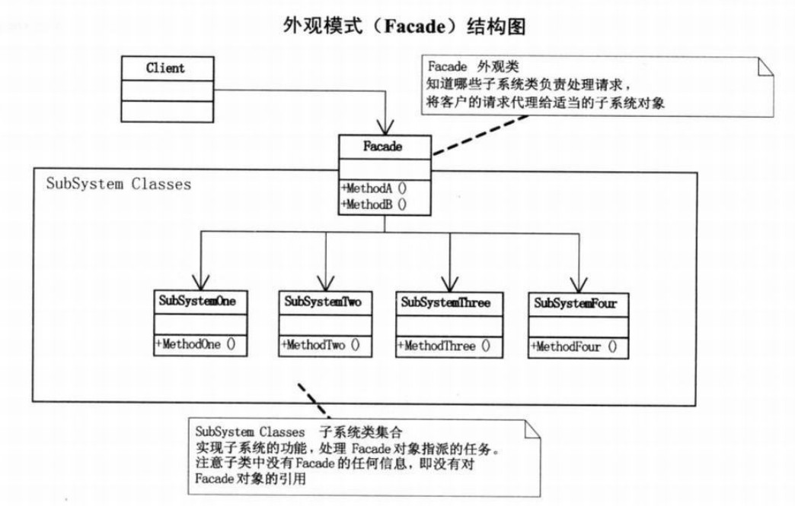

# 外观模式
##1.定义
###提供了一个统一的接口，用来访问子系统中的一群接口，从而让子系统更容易使用。

##2.类图

##3.应用场景
- 对分层结构系统构建时，使用外观模式定义子系统中每层的入口点可以简化子系统之间的依赖关系。
- 当一个复杂系统的子系统很多时，外观模式可以为系统设计一个简单的接口供外界访问。
- 当客户端与多个子系统之间存在很大的联系时，引入外观模式可将它们分离，从而提高子系统的独立性和可移植性。

##4.设计原则
###最少知识原则：只和你的密友谈话。也就是说客户对象所需要交互的对象应当尽可能少。