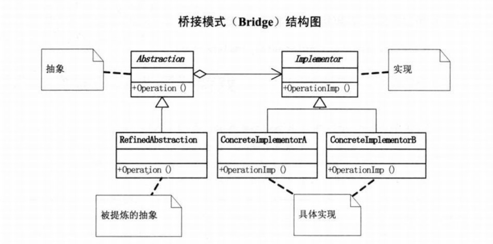
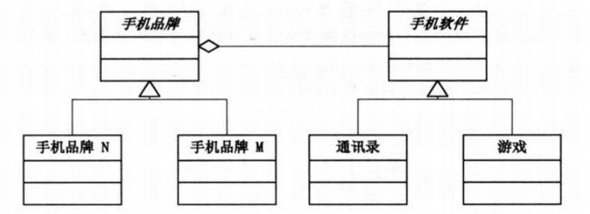

# 桥接模式
## 1.定义
### 桥接（Bridge）是用于把抽象化与实现化解耦，使得二者可以独立变化。这种类型的设计模式属于结构型模式，它通过提供抽象化和实现化之间的桥接结构，来实现二者的解耦。
### 这种模式涉及到一个作为桥接的接口，使得实体类的功能独立于接口实现类。这两种类型的类可被结构化改变而互不影响。

## 2.类图

### 将抽象部分与它的实现部分分离，理解为：实现系统可能有多角度分类，每一种更分类都有可能变化。那么就把这种多角度分离出来让他们独立变化，减少他们之间的耦合

