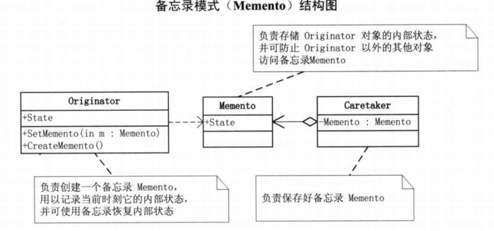

# 备忘录模式
##1.定义
###在不违反封装的情况下获得对象的内部状态，从而在需要时可以将对象恢复到最初状态。

##2.类图
- Originator：原始对象
- Caretaker：负责保存好备忘录
- Memento：备忘录，存储原始对象的的状态。备忘录实际上有两个接口，一个是提供给 Caretaker 的窄接口：它只能将备忘录传递给其它对象；一个是提供给 Originator 的宽接口，允许它访问到先前状态所需的所有数据。理想情况是只允许 Originator 访问本备忘录的内部状态。

