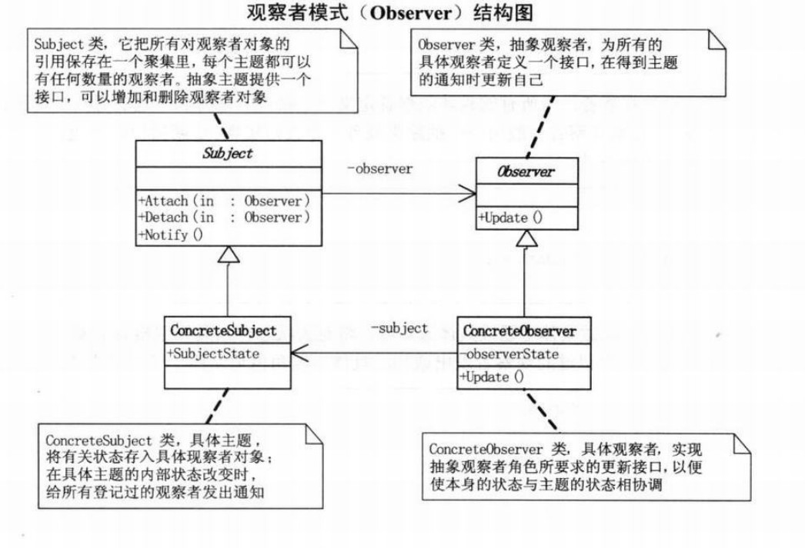
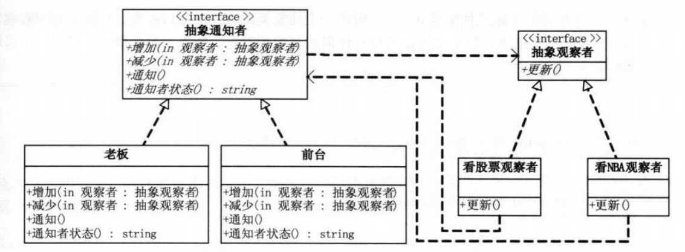

# 观察者模式
## 1.定义
### 观察者模式又叫 发布-订阅模式
### 定义对象之间的一对多依赖，当一个对象状态改变时，它的所有依赖都会收到通知并且自动更新状态。
### 主题（Subject）是被观察的对象，而其所有依赖者（Observer）称为观察者。

## 2.类图

## 3.解决问题
### 一个对象状态改变给其他对象通知的问题，而且要考虑到易用和低耦合，保证高度的协作。